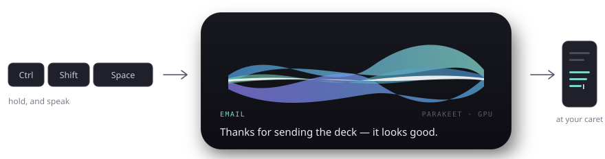

<div align="center">

# Verba

**Dictate anywhere on Windows. Hold a key, speak, let go — your words appear at the caret.**

Everything runs on your machine. No account, no cloud, no per-minute cost.

[](https://github.com/SambuddhaRoy/Verba/releases/latest) [](LICENSE) [](#requirements) [](https://github.com/SambuddhaRoy/Verba/actions/workflows/ci.yml)



</div>

---

## Get started

**1.** Download **[Verba.exe](https://github.com/SambuddhaRoy/Verba/releases/latest)** &nbsp;•&nbsp; **2.** Run it &nbsp;•&nbsp; **3.** Follow the one-minute setup

There is no installer. Verba lives in your system tray and writes only to `%LOCALAPPDATA%\Verba`.
First launch walks you through picking a microphone, downloading one speech model, and testing it.

> [!IMPORTANT]
> **Windows will warn you the first time.** The download isn't code-signed — a certificate
> costs several hundred dollars a year — so SmartScreen shows *"Windows protected your PC"*.
> Click **More info → Run anyway**. Every release publishes a SHA-256 you can check, and if
> you'd rather not trust a stranger's binary, [build it yourself](#building-from-source).

Then hold **`Ctrl` + `Shift` + `Space`**, say something, and let go.

---

## What makes it different

|  | |
|---|---|
| 🔒 **Genuinely local — and checkable** | Your voice never leaves the machine. **Settings → About** logs every connection Verba opens, live; a session of dictating adds nothing to it. |
| 🎯 **Knows where you're typing** | Reads the focused window and formats to match — an email in Outlook, bullets in Obsidian, a comment in your editor. |
| 🧠 **Learns your words** | Correct a transcript once or twice and Verba stops getting that word wrong. No vocabulary list to maintain. |
| 📚 **Domain packs** | Code, Medical and Legal vocabularies you can switch on together. "open paren" becomes `(`, "bee pee" becomes `BP`. |
| ✍️ **Optional AI polish** | With [Ollama](https://ollama.com) installed, a small local model turns spoken rambling into written prose. |
| 🎨 **Looks like Windows** | Follows your accent colour and light/dark theme, live — including when your wallpaper changes it. |

---

## How it decides the formatting

Verba looks at which application had focus when you started speaking and picks a mode.
Around fifty apps are mapped out of the box, and every rule is editable.

| Mode | Where it applies | What you get |
|---|---|---|
| **Raw** | Terminals | Exactly what you said, cleaned up |
| **Code** | VS Code, JetBrains, Sublime, Neovim | Symbols and identifiers, no prose padding |
| **Email** | Outlook, Thunderbird, Word | Connected prose, proper greeting and sign-off |
| **Chat** | Slack, Teams, Discord | Short and informal |
| **Notes** | Obsidian, Notion, OneNote | Bullets, nothing dropped |

Spoken punctuation ("new paragraph", "question mark"), filler words and capitalisation are
handled by plain rules — no model involved, so that step can never invent a word.

---

## Speech models

Pick one during setup; swap any time in **Settings → Models**. Downloads go to
`%LOCALAPPDATA%\Verba\models`.

| Model | Size | Best for |
|---|---:|---|
| Whisper Tiny | 31 MB | Old hardware, short commands |
| Whisper Small | 181 MB | The sensible default on a laptop |
| Whisper Large v3 Turbo | 547 MB | Near-best accuracy, multilingual |
| Parakeet TDT 0.6B | 460 MB | Fastest of the accurate ones, English |

Every model shows **separate accuracy and speed bars**, and speed is rated for *your* machine —
a large model is quick on a GPU and slow without one, and the bar says which you're looking at.
Verba recommends one based on your hardware and explains why.

<details>
<summary><b>Engines and Python</b></summary>

<br>

**whisper.cpp** is built into the binary with Vulkan GPU offload and needs nothing extra.
**Parakeet** (sherpa-onnx) and **faster-whisper** run as Python sidecars; Verba installs their
dependencies when you pick one.

Those two need **Python 3.9+**. Verba checks before you commit to an engine and offers to
install it via winget.

Note that Windows puts placeholder `python.exe` and `python3.exe` files on your PATH that only
open the Microsoft Store — so typing `python` in a terminal appears to work even with nothing
installed. Verba ignores those and finds a real interpreter. `--python` reports what it found.

</details>

---

## Verifying the local-first claim

Saying dictation is local is cheap. **Settings → About → Network activity** lists every
connection Verba opens, with its destination, the time, and why — updating as it happens.
Dictate, format and insert, and the list stays empty. Loopback is marked rather than
hidden, so a call to a local Ollama reads as what it is.

What makes the list worth trusting is not discipline: every request goes through one
module, and a test walks the source and fails the build if any call bypasses it. Try it —
route a request around the log and `cargo test` names the file and line.

It cannot see inside child processes. The faster-whisper and Parakeet engines are Python,
so when they install dependencies or fetch weights those connections belong to `pip` and
`huggingface_hub`. The panel says so rather than implying a completeness it doesn't have.

---

## Requirements

| | |
|---|---|
| **OS** | Windows 11 (Windows 10 probably works, untested) |
| **RAM** | 4 GB free for small models, 8 GB+ for the large ones |
| **GPU** | Optional — a Vulkan-capable GPU is used automatically |
| **Ollama** | Optional, only for the AI polish pass |

---

## Updates

Verba checks for new versions shortly after launch and every six hours, downloads them in the
background, and verifies each against the SHA-256 GitHub publishes. It only restarts once you've
gone two minutes without dictating, so an update never interrupts you. Turn it off in
**Settings → About**.

> The checksum and the download come from the same place, so this protects against a corrupted
> transfer — not against a compromised GitHub account. Real protection needs a signature made
> with a key that never touches GitHub, which this project doesn't have yet.

---

<details>
<summary><b>Building from source</b></summary>

<br>

```bash
git clone https://github.com/SambuddhaRoy/Verba
cd Verba
powershell -NoProfile -File tools/build.ps1
```

Output lands in `dist/Verba.exe`.

**Prerequisites**

- Rust, MSVC toolchain
- CMake and VS Build Tools with the C++ workload — whisper.cpp is compiled from source
- The Vulkan SDK for GPU offload; without it, build with `--no-default-features`
- `libclang`, because `whisper-rs-sys` generates its FFI bindings with bindgen

The libclang requirement is the awkward one. Rather than install the whole ~2.5 GB LLVM
toolchain for a single DLL:

```bash
pip install libclang
```

then copy `<site-packages>/clang/native/libclang.dll` into `src-tauri/.tools/`.
`src-tauri/.cargo/config.toml` points `LIBCLANG_PATH` there with a repo-relative path.

The crate's bundled `bindings.rs` is not a shortcut around this — it was generated on Linux and
carries glibc struct layouts that fail a const-eval size assertion under MSVC.

> [!WARNING]
> Cargo discovers `.cargo/config.toml` from the **working directory**, not from
> `--manifest-path`. Run cargo from inside `src-tauri/`, or `LIBCLANG_PATH` won't be set and the
> build fails in `whisper-rs-sys`.

**Tests**

```bash
cd src-tauri && cargo test
```

Covers the ring buffer's absolute indexing, resampling, keyboard event construction, formatting
rules, the correction diff, pack integrity, hardware scoring, SHA-256 against the FIPS vectors,
and the guard that stops a dictation typing into Verba's own window.

</details>

<details>
<summary><b>Diagnostics — the built-in instruments</b></summary>

<br>

The binary carries its own instruments. Each exists because something was once wrong that
couldn't be diagnosed by reading the code.

| Command | What it answers |
|---|---|
| `--state` | The exact payload the settings window renders from |
| `--python` | Which interpreter the sidecar engines will use, and why |
| `--meters [secs]` | Live spectrum from the real microphone |
| `--transcribe <wav>` | Engine timing without the hotkey or overlay |
| `--format <text> <exe>` | Mode routing and both formatting passes, no microphone |
| `--learned` | Every learned term, and what each engine does with it |
| `--fix "<heard>" "<meant>"` | Record a correction without dictating it |
| `--accent` | The Windows accent colour and theme as Verba resolves them |
| `--capture-test` | Whether the desktop capture behind the overlay works |
| `--inject-test <text>` | Text insertion with no model and no microphone |
| `--overlay-test [visual]` | Drive the overlay through its states |
| `--onboard` | Replay the first-run flow |
| `--check-update` / `--self-update` | Check for, or run, an update now |

</details>

---

## Status and known gaps

Verba is early. It works and is used daily, but the version number is honest.

- Parakeet runs offline rather than truly streaming.
- No dictation history yet.
- Per-mode override hotkeys aren't implemented.
- Windows 10 is untested; Linux and Android are not supported — the platform layer is Win32 throughout.
- **Tools that restyle windows draw a panel around the overlay.** Windhawk's
  translucent-windows mod is the common one: it paints the whole window rectangle, and
  Verba's is a large mostly transparent canvas, so the effect frames the visible panel.
  Nothing inside Verba's own process stops it — a DWM backdrop attribute, an
  `ACCENT_DISABLED` composition attribute and a window region were all measured against
  the mod and none worked. **Settings → Appearance → Shrink the overlay window** cuts the
  band from about ninety pixels a side to under ten; adding `Verba.exe` to the tool's own
  excluded-programs list removes it entirely.
- The binary is unsigned.
- **Recogniser bias is whisper-only.** Learned terms and pack vocabulary are fed to whisper via
  `initial_prompt`. sherpa-onnx has hotwords, but it encodes them against the model's own token
  table and Parakeet ships a 1025-piece BPE vocabulary with no sentencepiece model to split new
  words with, so every hotword is rejected. On Parakeet, learned terms still apply as
  deterministic rewrites — the model itself just isn't steered.

---

## Licence

[GPL-3.0](LICENSE). Use it, study it, share it, change it. If you distribute a modified version
it must also be GPL-3.0 with source available.

Bundled components keep their own licences: whisper.cpp (MIT), Tauri (MIT/Apache-2.0),
sherpa-onnx (Apache-2.0). Speech models carry their own terms, shown beside them in the models
list — Parakeet is CC-BY-4.0 from NVIDIA.

Copyright © 2026 Sambuddha Roy.
